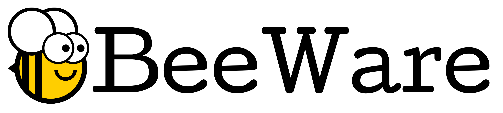
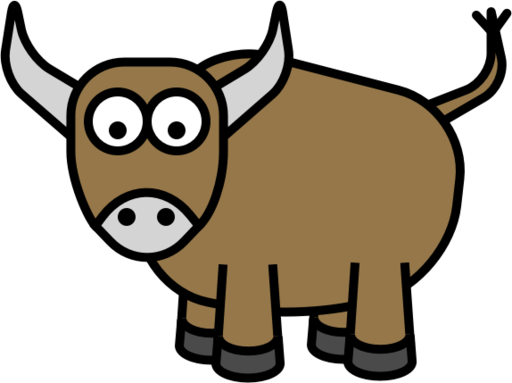
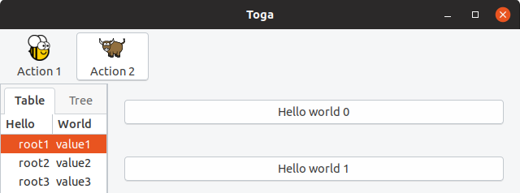
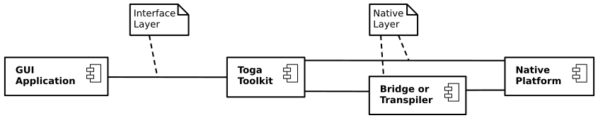
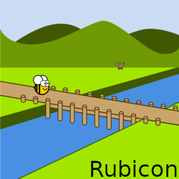
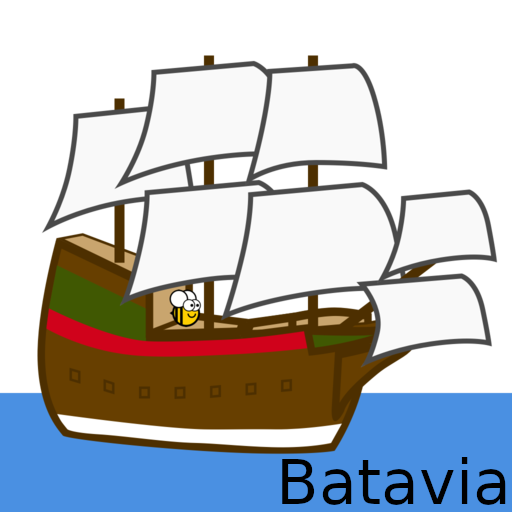
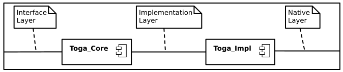
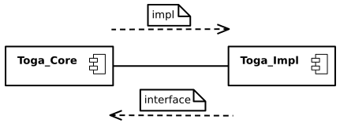
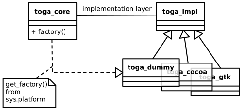
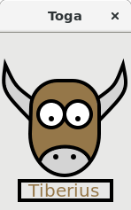

## 5 Steps to Build Python Native GUI Widgets for

<!-- .element style="border: 0; box-shadow: None" -->

---

BeeWare is

### Cross-platform
### Native
### App development
### with Python

and

### Simple app deployment

---
# Toga
## Beeware's GUI Toolkit

<!-- .element style="border: 0; box-shadow: None" -->

---

# Hello World

<!-- .element style="border: 0; height: 500px; box-shadow: None" -->

Notes:
import toga

class HelloWorld(toga.App):
    def startup(self):
        self.main_window = toga.MainWindow(title=self.name)
        main_box = toga.Box()
        self.main_window.content = main_box
        self.main_window.show()

def main():
    return HelloWorld('Hello World', 'org.pybee.helloworld')

---

# Background

A widget is the controls and logic that a user interacts with when using a GUI

<!-- .element style="border: 0; box-shadow: None" -->

A Canvas widget will be used as an example

---

# Toga Blackbox

<!-- .element style="border: 0; box-shadow: None" -->

---

# Bridge or Transpiler

<!-- .element style="border: 0; box-shadow: None" -->

<!-- .element style="border: 0; box-shadow: None" height="256" -->

<!-- .element style="border: 0; box-shadow: None" height="256" -->

---

# Toga Whitebox

<!-- .element style="border: 0; box-shadow: None" -->

---

# Nomenclature

<!-- .element style="border: 0; box-shadow: None" -->

---

# Toga_Impl Factory Pattern

<!-- .element style="border: 0; box-shadow: None" -->

---

# Step 0
## development platform
* Normally pick the platform that you are most familiar with
* macOS and Gtk+ are the most developed 👍
* Is this a mobile only widget (camera, GPS, etc)?

---

# Step 1
## Research your widget
* How do you create this widget on different platforms
* Think, brainstorm, whiteboard, and discuss how you would want to create and manipulate this widget with Python

---
## Research your widget
Tkinter

<!-- .element style="border: 0; box-shadow: None" -->

Notes:
import tkinter as tk

root = Tk()
canvas = tk.Canvas()
canvas.create_rectangle(10, 10, 100, 100, fill="red")
canvas.pack()
root.mainloop()

4 Steps:
Create, Configure, Pack, and Bind

---

## Research your widget
GTK

<!-- .element style="border: 0; box-shadow: None" -->

Notes:
drawingarea = Gtk.DrawingArea()
drawingarea.connect("draw", draw)
def draw(da, ctx):
    ctx.set_source_rgb(200, 0, 0)
    ctx.rectangle(10, 10, 100, 100)
    ctx.fill()

---

##  Research your widget
Use Cases

<!-- .element style="border: 0; box-shadow: None" -->

---

# Step 2

## Write Docs
* Write your API documentation first
* The API provides the set of clearly defined methods of communication (layers) between the software components
* Documentation Driven Development
* This is iterative with Step 1

---
## Write Docs

<!-- .element style="border: 0; box-shadow: None" -->

Notes:
The canvas is used for creating a blank widget that you can
draw on.

## Usage

An example of simple usage is to draw a colored rectangle on
the screen using the `rect` drawing object:

import toga
canvas = toga.Canvas(style=Pack(flex=1))
with canvas.fill(color=rgb(200, 0, 0)) as fill:
    fill.rect(10, 10, 100, 100)

---
## Write Code Outline / Docstrings

<!-- .element style="border: 0; box-shadow: None" -->

Notes:
class Canvas(Context, Widget):
    """Create new canvas.

    Args:
        id (str):  An identifier for this widget.
        style (:obj:`Style`): An optional style object. 
        factory (:obj:`module`): A python module that is
            capable to return a implementation of this class.
            
     """

---

# Step 3

## Implement Toga_core
### (with TDD)
* First write tests for Toga_core
* Then code the outline created in Step 2

---

## Write tests for Toga_core

<!-- .element style="border: 0; box-shadow: None" -->

Notes:
def test_widget_created():
    assertEqual(canvas._impl.interface, canvas)
    self.assertActionPerformed(canvas, "create Canvas")

---

## Write tests for Toga_core

<!-- .element style="border: 0; box-shadow: None" -->

Notes:
def test_rect_modify():
    rect = canvas.rect(-5, 5, 10, 15)
    rect.x = 5
    rect.y = -5
    rect.width = 0.5
    rect.height = -0.5
    canvas.redraw()
    self.assertActionPerformedWith(
    	    canvas, "rect", x=5, y=-5, width=0.5, height=-0.5
        )

---

## Code toga_core

<!-- .element style="border: 0; box-shadow: None" -->

Notes:
class Canvas(Widget):
    def __init__(self, id=None, style=None, factory=None):
        super().__init__(id=id, style=style, factory=factory)

        # Create a platform specific implementation of Canvas
        self._impl = self.factory.Canvas(interface=self)
    
    def rect(self, x, y, width, height):
        self.impl.rect(
            self.x, self.y, self.width, self.height
        )

---
# Step 4
## Implement Toga_impl
### dummy backend

* Dummy is for automatic testing without a native platform
* Code the implementation layer API endpoint, create a method for each call of the API
* Check that all tests now pass
---
## Implement Toga_impl
### dummy backend

<!-- .element style="border: 0; box-shadow: None" -->

Notes:
class Canvas(Widget):
    def create(self):
        self._action("create Canvas")
        
    def rect(self, x, y, width, height):
        self._action(
            "rect", x=x, y=y, width=width, height=height
        )

---

# Step 5
## Implement Toga_impl
### your platform

* Copy toga_dummy and create a new endpoint for the platform you chose in Step 1
* Make use of the native interface API for this widget on your platform

---

## Implement Toga_impl
### your platform

<!-- .element style="border: 0; box-shadow: None" -->

Notes:
class Canvas(Widget):
    def create(self):
        self.native = Gtk.DrawingArea()
        self.native.connect("draw", self.gtk_draw_callback)
    
    def gtk_draw_callback(self, canvas, gtk_context):
        self.interface._draw(self, draw_context=gtk_context)

    def rect(self, x, y, width, height, draw_context):
        draw_context.rectangle(x, y, width, height)

---

## Implement Toga_impl
### other platforms

<!-- .element style="border: 0; box-shadow: None" -->
    
Notes:
class TogaCanvas(NSView):
    @objc_method
    def drawRect_(self, rect: NSRect) -> None:
        context = NSGraphicsContext.currentContext.graphicsPort()

class Canvas(Widget):
    def create(self):
        self.native = TogaCanvas.alloc().init()

    def rect(self, x, y, width, height, draw_context, *args, **kwargs):
        rectangle = CGRectMake(x, y, width, height)
        core_graphics.CGContextAddRect(draw_context, rectangle
---

#   

1. Research Your Widget
2. Write Docs
3. Toga_core
4. Toga_impl - Dummy Backend
5. Toga_impl - Your Platform

---

## Submit a pull request!  
  
## 🎉👍💖

---

@danyeaw  
  
github.com/danyeaw  
  
dan.yeaw.me  
  
linkedin.com/in/danyeaw  
  
dan@yeaw.me  
