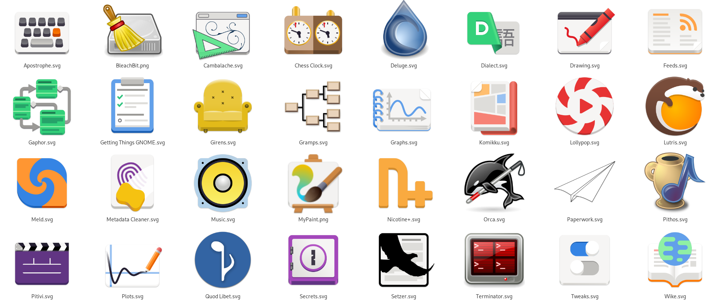
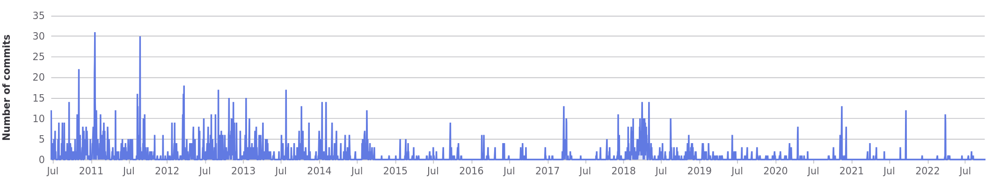
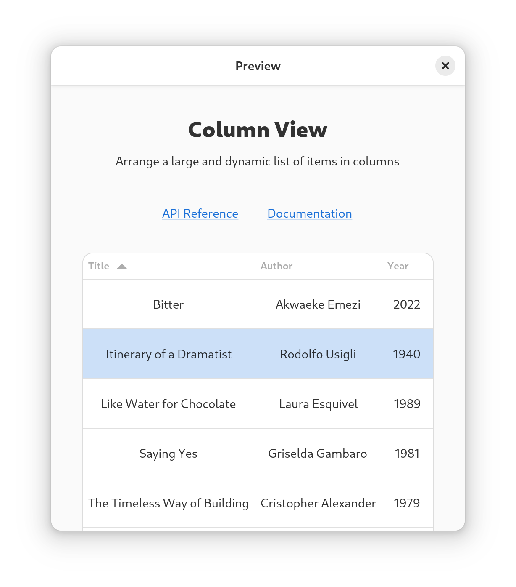
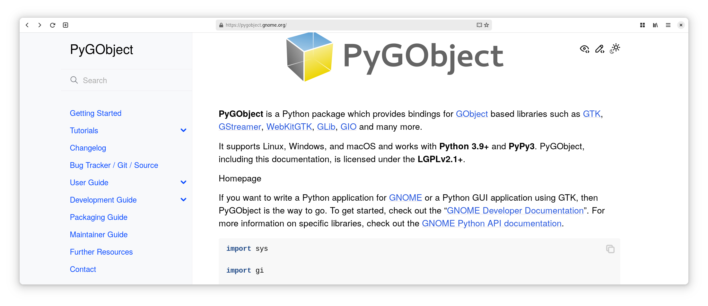

% Showing Up for Python in GNOME
% Dan Yeaw (`dan@yeaw.me`)
% July 20, 2024

## About Me

- Dan Yeaw (pronounced: Yaw)
- Originally from California, now lives in Michigan
- Co-maintainer of Gaphor, SysML/UML Modeling tool (GNOME Circle)
- Co-maintainer of Gvsbuild for building GTK on Windows
- GNOME Foundation member, developer access this year
- Hosts Michigan Python monthly
- Works for Ford Motor Company on Functional Safety

::: notes

Hi, I'm Dan Yeaw, and I'm sooo excited to talk to you about Showing up for Python in GNOME!!

:::

## Unleashing Interests with Python

```python
>>> import pypokedex
>>> pokemon = pypokedex.get(name="Decidueye")
>>> pokemon.name
'decidueye'
>>> pokemon.types
['grass', 'ghost']
>>> pokemon.base_stats
BaseStats(hp=78, attack=107, defense=75, sp_atk=100, sp_def=100)
```

```{=latex}
\begin{center}
```

{height=25%}

```{=latex}
\end{center}
```

::: notes

With a little help, my 10 year old son can figure out how make simple games and apps with Python, his latest project is trying to make a Pokedex for Pokemon. He loves geeking out on Pokemon, and that it is so much fun to see people get deep in to their interests!

Python is easy to learn, but hard to master - it scales easily with your skillset. It is such an important language for our ecosystem. It is often used by students, researchers, and non-professional programmers. It is used by artists, data scientists, web developers, sysadmins, and astronomers.  

With Builder, Workbench, and Flatpak, it has never been easier to build an app for GNOME. This is the big tent, that we need, where we make room for and make it easy for all kinds of people to build small apps for their projects to geek out on their interests. Python is the perfect language this - so we need to make sure the GNOME experience with it lives up to this.

:::

## GNOME Python

- PyGObject is the GTK and related library bindings for Python

{height=65%}

::: notes

PyGObject is Python in GNOME. It is the successor to PyGTK that James Henstridge started in 1998 that uses gobject-introspection directly to allow you to build GNOME apps using Python. If you see the patterns in the app icons here, those deep interests that people geek out on includes drawing and art, modeling, graphing, music, genealogy, manga, classic gaming, and scientific reports.

:::

## On PyGObject

> The current state of the Python bindings for GObject-based libraries is making it really hard to recommend using Python as a language for developing GTK and GNOME applications.

Emmanuele Bassi (2022)

::: notes

In December 2022, Emmanuele Bassi wrote a blog post called "On PyGObject" with a call to action to get involved to help Christoph Reiter, the maintainer of the library. He went through 3 large use cases of features missing in PyGObject which was really make it hard to recommend. These included:

1. Typed Instances for things like GtkExpression, GtkRenderNode, and GtkEvent. These Foundational Types were supported since they aren't based on GObjects.
2. The base wrapper for GObject itself is written in Python instead of using gobject-introspection directly. However, this means that constructing and disposing of objects can be difficult because PyGObject doesn't automatically get access to the functions for doing those operations.
3. Documentation is spread out everywhere, and a lot of it wasn't updated for GTK4.

:::

## Commits Over Time

 

- Major contributors left the project over time.
- Christoph Reiter heroically held things together since 2017.
- However, the number of changes started to fall off, especially after 2020.

::: notes

You can see the pattern of this in the commit history, although it isn't the only or even most important indicator of community health. Major contributors like Simon Feltman, John Palmieri, and Martin Pitt left the project - which is a natural part of open source. Christoph kept the fires burning late in to the nights, but he was also working on other important open source projects like MSYS2. PyGObject was mostly idling along with absolutely necessary changes only. This is also the same time frame that GTK4 was released, so there was a lot of changes going on in the wider ecosystem of libraries.

:::

## Getting Involved in an Undermaintained Project

- Contributing to an undermaintained project can be difficult
- Each extra contribution is placing a burden on the developer
- Timely feedback to contributions is often not possible
- To outsiders, the GNOME project can feel hard to join, especially in these undermaintained areas

::: notes

Major open source projects really need a contribution funnel to get more people involved. This type of community building requires many hands to help newcomers, triage issues, review contributions, answer questions, and provide support.

Unfortunately, it is all too common to have one person trying to hold everything together on multiple projects. However, this is a catch-22, that one person is barely holding things together, and each issue raised, each merge request submitted is extra work and burden for them.

It doesn't feel welcoming to new people if they show up to help and their contributions dead rot, it is natural to move along and spend your time on things that you feel are making a difference.

Since GNOME is a whole project and developer access is across the project, this adds an extra layer of complexity to try to figure out how to get through. For an undermaintained project, it can feel like the GNOME community is behind a city wall, and your knocking on the unmanned gate trying join.

:::

## Community Building
```{=latex}
\begin{center}
```

{height=50%}

```{=latex}
\end{center}
```

- The GNOME Project Handbook greatly improves clarity on how to get involved
- The GNOME Foundation could also take a greater role

::: notes
Wow! The GNOME Project Handbook which was released at the end of January. is such a special resource to document for everyone how to get involved and the expectations. A big shout out to the team whole helped make that happen!

Since GNOME as a project is made up of volunteers and individuals paid by companies with their own priorities, it can often be difficult to shift resources to help out a part of the ecosystem. Emmanuele shouldn't have to write blog posts asking for people to help get involved. There may be an opportunity for the GNOME Foundation here to track the health of key GNOME projects using metrics and then provide community building support for those that are starting to have challenges to help them out before it becomes an issue.
:::

# The State of Python in GNOME

::: notes

Let's switch gears a bit, over the last year, PyGObject has made some significant improvements!

:::

## Issue and Merge Request Triage

- Closed about 200 issues
- Total issue count went from over 300 to 175
- Open or draft merge requests went from 30 to 19

::: notes
Let's start with the basics! A clean issue and merge request backlog is important for a thriving community. We made some major inroads over the last year to reduce the total open issue and merge request counts.

Although we haven't quite got all the way to just the subset that we are really going to work on, issues in this 100-200 range feels good - something that contributors can get their head around. Much more than this often feels overwhelming.

:::

## Fundamental Types

- Most objects inherit from GObject
- GtkExpression, GtkRenderNode, and GtkEvent do not
- These are defined as a `GObject.TypeInstance`

::: notes

GObject is the base type system and object class and is used for most of GTK and related libraries. Types are the fundamental part of a programming language like C, to translate a type like a char to the machine architecture with a minimum size like 8 bits and a maximum size. GLib provides a type system for GTK related libraries. Most of these types are fundamental types that are instantiated by GLib automatically, like a gchar. Most objects are created by inheriting from GObject to get memory management, properties like getters and setters, and construction/deconstruction of instances. However, not every piece of data used in a GTK application needs all that. So other fundamental types are created by defined by Gtk by defining a class and instance structure. Up until recently, PyGObject didn't support making use of these Fundamental types for data in your program like Expressions, RenderNodes, and Events. Let's jump in to an example!

:::

## Workbench Column View Example

```{=latex}
\begin{center}
```

{height=85%}

```{=latex}
\end{center}
```

::: notes

Workbench is this great app for learning and prototyping GNOME apps created by Sonny Piers and lots of contributions from the community to create tutorials in Vala, Python, Rust, and Javascript - I highly recommend it!! Here you can see the ColumnView example. ColumnView was added in GTK4 as an easier way to create a table of data. 

Here is a list of books with title, author, and year. You can sort the columns by clicking on the column header, and also select a row which is shown in the light blue.

For Gaphor, I would like to integrate a table view of MBSE diagrams for doing analysis. So I really wanted to make use of a ColumnView.

:::

## Sorting

- Gtk provides an easy way to sort columns
- Create a Sorter and then pass in a `Gtk.PropertyExpression`
- `this -> item -> property`
- Unfortunately, it isn't so easy without Fundamental Types

::: notes

As we saw in the ColumnView, being able to click on a column header to sort it is important or even expected functionality. For strings, sorting A-Z is needed and for numbers sorting high to low.

Since this is a common use case, Gtk provides a straightforward way to enable this sorting using a type of Expression called a PropertyExpression. An Expression is a way to describe a reference to a value and a Property Expression does what it sounds like, it  provides a property value in an Expression.

This is different than normal property bindings, because the object which is being bound doesn't have to exist when the expression is created. The expression is called `this`. It references an item, which has a property. The expression is getting the value of this property.

It is still possible to sort columns without expressions, but it is a lot of work!

:::

## Sorting without Expressions - Creating a Sorting Model

```python
column_view = workbench.builder.get_object("column_view")
col1 = workbench.builder.get_object("col1")
col2 = workbench.builder.get_object("col2")
col3 = workbench.builder.get_object("col3")

model_func = lambda _item: None
tree_model = Gtk.TreeListModel.new(ta_model, False, True, model_func)
tree_sorter = Gtk.TreeListRowSorter.new(column_view.get_sorter())
sorter_model = Gtk.SortListModel(model=tree_model, sorter=tree_sorter)
selection = Gtk.SingleSelection.new(model=sorter_model)
column_view.set_model(model=selection)
```

::: notes


This fixes a ton of low level issues. you’ll be able to do advanced custom drawing using render nodes, as well as accessing low level windowing system event objects, in your Python applications.

:::

## Sorting without Expressions - Creating Sorting Logic

```python
def str_sorter(object_a, object_b, column):
    a = getattr(object_a, column).lower()
    b = getattr(object_b, column).lower()
    return (a > b) - (a < b)

def int_sorter(object_a, object_b, column):
    a = getattr(object_a, column)
    b = getattr(object_b, column)
    return (a > b) - (a < b)

col1.set_sorter(Gtk.CustomSorter.new(str_sorter, "title"))
col2.set_sorter(Gtk.CustomSorter.new(str_sorter, "author"))
col3.set_sorter(Gtk.CustomSorter.new(int_sorter, "year"))
```

::: notes

Next we need to create our sorting logic. The first function we define is for sorting strings, like for the title and author columns. This function takes two objects and the column. It then gets both values using getattr, and sets them to lowercase so that the case of the string doesn't impact the sorting order.

Then it compares the first character of the string based on the unicode ordinal value of the character. If they are the same, then it compares the next character. If a is larger than b, the function returns 1, and if b is larger than a it returns -1. The integer sorting function works the same, except no lowercase is needed and the integers are directly compared.

Finally, we set the sorter of each column using Custom Sorters that we created. Wow, we did it, but that was a lot of work!

:::

## Sorting with Expressions

```python
col1_exp = Gtk.PropertyExpression.new(Book, None, "title")
col2_exp = Gtk.PropertyExpression.new(Book, None, "author")
col3_exp = Gtk.PropertyExpression.new(Book, None, "year")

col1.sorter = Gtk.StringSorter.new(col1_exp)
col2.sorter = Gtk.StringSorter.new(col2_exp)
col3.sorter = Gtk.NumericSorter.new(col3_exp)
```

::: notes

The implementation of Fundamental Types in PyGObject fixes use case number 1 from the On PyGObject blog post. The original work to support this was started in 2010, and Arjan Molenaar brushed it off and brought it home.

Now we can make use of Expressions! Here we create three property expressions, pass in our Book class, None because we don't need to evaluate an extra Expression, and then the column name.

Finally we set the sorter for each column to String Sorters for the title and author columns and Numeric Sorters for the year column and pass in the Property Expressions we just created. Said another way the sorter for each column is bound to the property of the book for that column.

:::

## https://pygobject.gnome.org



::: notes
We use to have the pygobject docs hosted on read the docs. Rafael Mardojai also had a really nice PyGObject-Guide which was a tutorial based on the Python GTK+3 Tutorial by Sebastian Pölsterl. We worked with the communities to convert the projects from the GNU Free Documentation License to the LGPL, merged the tutorials with the other docs, and moved them to a more official pygobject.gnome.org subdomain.
:::


## meson-python and PDM

```bash
meson setup _build
meson test -C _build
```

or

```bash
pdm install
pdm run pytest
```

::: notes
We moved from the legacy setup.py to the more modern pyproject.toml. We are using Meson for the build backend and using PDM to manage the project dependencies and virtualenvs.
:::

## Modernize API Docs

- Modernize building docs using GI-DocGen and Sphinx

### Template

`class Template(**kwargs)`

### Methods

```
	classmethod from_file(filename)
        Parameters: filename

    classmethod from_resource(resource_path)
        Parameters: resource_path

```

::: notes
Just like many other libraries have been upgrading from GTK-Doc to GI-DocGen, PyGObject also recently made the switch. GI-Docgen reuses the introspection data generated by GObject-based libraries to generate the API reference of these libraries.

Previously, we were using pgi-docgen, which was a more custom way
to read GIR docs and then create a Sphinx website from them.

Previously missing documentation, like for Gtk.Template is now available and because we are using the introspection data directly
less maintenance is required going forward.
:::

## Main Branch

- Small change to rename the primary branch to main
- Improves exclusivity and standardization with other GNOME projects

## Experimental: Asyncio Integration

- Implements Python asyncio await for Gio async results

```python
async def idle_test():
    bus = await Gio.bus_get(Gio.BusType.SYSTEM)
    # Actual bus call requires more paramters
    await bus.call("org.freedesktop.NetworkManager")

policy = GLibEventLoopPolicy()
asyncio.set_event_loop_policy(policy)
loop = policy.get_event_loop()
loop.run_until_complete(idle_test())
```

<!---
After 2 years of work, Benjamin Berg finished an initial implementation of Asyncio integration with PyGObject which was merged this week! This approach uses the GMainLoop to drive the EventLoop, as opposed to other approaches like GBulb and aysncio-glib which implement a full EventLoop or have the EventLoop drive the GMainContext.
-->


# The Future

## Wheels for Windows

- Python 3.8+ no longer loads DLLs on the path
- Building GTK using MSVC with `pip install pygobject` doesn't work for getting started
- Solution: build wheels of PyGObject with the DLLs included

::: notes
For security reasons, Python 3.8 stopped automatically loading DLLs on the path on Windows. Many libraries including PyGObject previously depended on this behavior. If you do build GTK on Windows using Gvsbuild or with MSVC directly, you don't end up with a working PyGObject without manually loading the DLLs or patching PyGObject.

We have discussed options to fix this, and there hasn't been much excitement in adding a DLL search routine in PyGObjects startup code. However, a Wheel format allows for DLLs to be bundled along side of the project though and then they are automatically loaded. This would also significantly improve install time as well, since users can directly install a pre-compiled version of PyGObject instead of compiling it during the installation.
:::

## Port to `libgirepository-2.0`

- `libgirepository` is now part of GLib
- The main enhancement is it now uses `GObject.TypeInstance` instead of C struct aliasing
- Utility programs are also renamed:

| girepository-1.0 | girepository-2.0      |
|------------------|-----------------------|
| g-ir-compiler    | gi-compile-repository |
| g-ir-generate    | gi-decompile-typelib  |
| g-ir-inspect     | gi-inspect-typelib    |

::: notes
This one is more of a chore to make sure that PyGObject is using the latest libraries. libgirepository was originally part of
gobject-introspection, however it is now very stable and has been integrated with GLib to improve the build process to prevent circular dependencies between GLib and gobject-introspection.

The main change between the two versions of libgirepository is that it now uses GObject.TypeInstance as the basis of its type system, rather than simple C struct aliasing. 

The symbol prefix was also updated from `g_` to `gi_`, various function arguments changed, and there were some modification to stack allocation.

Philip Withnall started this work to port PyGObject, and Arjan Molenaar has picked it up to try to bring it home.
:::

## Move API Docs

- Combine and merge the API docs to https://pygobject.gnome.org
- Would finish centralizing all docs

## Call to Action

- Contributions of any kind will help continue to help the community thrive
- Submit and help triage issues
- Continue to help us improve the docs
- Help us fix bugs and implement features
- Add examples to Workbench
- Build projects with PyGObject

::: notes
Many of you have even more ideas on what we could improve next, and we would love to have your contributions!

:::